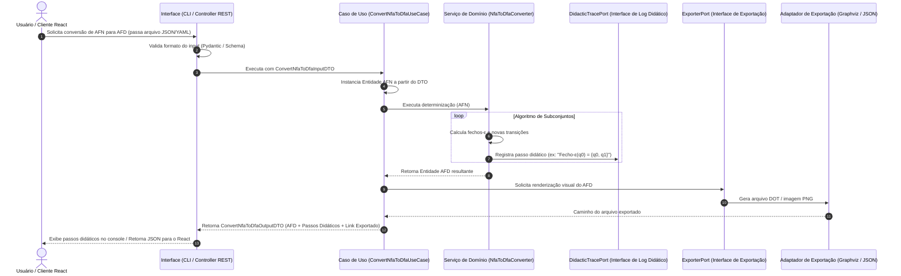

# Arquitetura de Software: Simulador de Autômatos e Gramáticas

Este documento apresenta a especificação arquitetural completa para o simulador acadêmico de autômatos e gramáticas regulares. O projeto é desenvolvido utilizando os princípios da **Clean Architecture (Arquitetura Limpa)** em Python 3.12+, garantindo baixo acoplamento, alta coesão, domínio completamente isolado e preparação para múltiplas interfaces de usuário (CLI, API REST e React).

---

## 1. Responsabilidade de Cada Camada

A estrutura segue a organização do projeto em pastas específicas, segregando as responsabilidades de forma que a dependência aponte sempre de fora para dentro.

```
projeto/
├── core/            # Camada de Domínio (Core Domain)
├── application/     # Camada de Aplicação (Use Cases & Ports)
├── infrastructure/  # Camada de Infraestrutura (Adapters & External Tools)
├── interface/       # Camada de Interface de Usuário (CLI & REST Controllers)
├── tests/           # Suíte de Testes (Unitários, Integração e E2E)
└── docs/            # Documentação Técnica e Acadêmica
```

### Core (Domínio)
* **Objetivo:** Representar o coração das regras de negócio do sistema (a teoria formal dos autômatos e gramáticas).
* **Dependências:** Nenhuma. É 100% isolado de bibliotecas externas, frameworks, bancos de dados ou interfaces.
* **Conteúdo:** Entidades de domínio (ex: `Automato`), Objetos de Valor (ex: `Estado`, `Transicao`), Serviços de Domínio (algoritmos matemáticos puros, ex: determinização, minimização) e Exceções de Domínio.

### Application (Aplicação)
* **Objetivo:** Orquestrar o fluxo de dados do sistema, implementando os Casos de Uso (Use Cases) acadêmicos.
* **Dependências:** Depende exclusivamente do `Core`.
* **Conteúdo:** Casos de Uso (Interactors), DTOs (Data Transfer Objects) para entrada e saída de dados, e as Portas (Interfaces) necessárias para persistência, logging acadêmico e exportação.

### Infrastructure (Infraestrutura)
* **Objetivo:** Fornecer implementações concretas (Adapters) para os recursos externos e portas definidos pela aplicação.
* **Dependências:** Depende de `Application` e `Core`.
* **Conteúdo:** Adaptadores de exportação (Graphviz DOT, exportador JSON/XML), adaptadores de persistência em arquivos, mecanismos de logs técnicos e configurações globais.

### Interface (Interface de Usuário)
* **Objetivo:** Ponto de entrada de interação com o usuário ou sistemas externos.
* **Dependências:** Depende de `Application` e `Core` (apenas para referências de DTOs).
* **Conteúdo:**
  * **CLI:** Implementação da linha de comando, interpretando os argumentos do usuário e apresentando os resultados didáticos.
  * **API (Futura):** Controladores REST (ex: FastAPI) que expõem endpoints HTTP para serem consumidos por uma futura interface React.

### Tests (Testes)
* **Objetivo:** Garantir o funcionamento correto de cada componente por meio de testes unitários de domínio, testes de integração de adaptadores e testes ponta-a-ponta (E2E) dos casos de uso.

### Docs (Documentação)
* **Objetivo:** Centralizar artigos acadêmicos, diagramas de estado, especificações de requisitos e guias de uso didático.

---

## 2. Fluxo Completo de Dados

O fluxo de dados segue o padrão tradicional da Clean Architecture, garantindo a inversão de dependência através de portas e adaptadores.

### Cenário de Exemplo: Conversão de AFN para AFD via CLI ou REST API



---

## 3. Casos de Uso do Sistema (Use Cases)

Os casos de uso encapsulam as ações que o usuário pode realizar no sistema, orquestrando a lógica de domínio e interfaces externas de forma isolada.

1. **`CriarAFN`**
   * **Objetivo:** Instanciar um Autômato Finito Não-Determinístico (AFN), validar suas regras formais de consistência matemática e persistir sua estrutura.
   * **Entrada:** `CriarAFNInputDTO`.
   * **Saída:** `CriarAFNOutputDTO`.

2. **`ConverterAFNParaAFD`**
   * **Objetivo:** Converter um AFN cadastrado em um AFD equivalente utilizando o algoritmo clássico de Determinação (Subset Construction), gerando o passo-a-passo didático.
   * **Entrada:** `ConverterAFNParaAFDInputDTO`.
   * **Saída:** `ConverterAFNParaAFDOutputDTO`.

3. **`SimularPalavra`**
   * **Objetivo:** Simular o processamento passo-a-passo de uma cadeia de símbolos em um autômato, reportando a aceitação e a árvore de execução para fins didáticos.
   * **Entrada:** `SimularPalavraInputDTO`.
   * **Saída:** `SimularPalavraOutputDTO`.

4. **`MinimizarAFD`**
   * **Objetivo:** Minimizar um AFD existente no sistema, eliminando estados inacessíveis e fundindo estados equivalentes.
   * **Entrada:** `MinimizarAFDInputDTO`.
   * **Saída:** `MinimizarAFDOutputDTO`.

5. **`ConverterAFParaGR`**
   * **Objetivo:** Traduzir um Autômato Finito (DFA/NFA) em uma Gramática Regular equivalente.
   * **Entrada:** `ConverterAFParaGRInputDTO`.
   * **Saída:** `ConverterAFParaGROutputDTO`.

6. **`ConverterGRParaAF`**
   * **Objetivo:** Converter uma Gramática Regular (linear à direita/esquerda) em um Autômato Finito Não-Determinístico equivalente.
   * **Entrada:** `ConverterGRParaAFInputDTO`.
   * **Saída:** `ConverterGRParaAFOutputDTO`.

7. **`ExportarResultado`**
   * **Objetivo:** Exportar os modelos ou simulações para arquivos em formatos específicos de representação visual ou estruturada.
   * **Entrada:** `ExportarResultadoInputDTO`.
   * **Saída:** `ExportarResultadoOutputDTO`.

---

## 4. Entidades do Domínio

As entidades representam os conceitos primários da teoria da computação com identidades únicas, encapsulando regras de integridade matemática estrutural.

* **`Automato` (Entity)**
  * **Descrição:** Representa a quíntupla formal $M = (Q, \Sigma, \delta, q_0, F)$.
  * **Atributos:**
    * `id`: Identificador único da entidade.
    * `tipo`: Tipo do autômato (DFA, NFA, E-NFA) usando enum.
    * `estados`: Conjunto de objetos `Estado`.
    * `alfabeto`: Objeto `Alfabeto`.
    * `transicoes`: Conjunto de objetos `Transicao`.
    * `estado_inicial`: Objeto `Estado` pertencente a `estados`.
    * `estados_finais`: Conjunto de objetos `Estado` contidos em `estados`.
  * **Regras de Invariância (Validação de Negócio):**
    * O estado inicial deve pertencer ao conjunto de estados.
    * Os estados finais devem ser um subconjunto dos estados.
    * As transições devem conter apenas estados e símbolos presentes no autômato.
    * Se for DFA, não pode haver transições não-determinísticas ou de fecho-ε.

* **`GramaticaRegular` (Entity)**
  * **Descrição:** Representa a quádrupla formal $G = (V_N, V_T, P, S)$.
  * **Atributos:**
    * `id`: Identificador único.
    * `nao_terminais`: Conjunto de variáveis (símbolos não-terminais).
    * `terminais`: Conjunto de constantes (símbolos terminais).
    * `regras_producao`: Conjunto de objetos `RegraProducao`.
    * `simbolo_inicial`: Variável não-terminal de partida.
  * **Regras de Invariância:**
    * O símbolo inicial deve pertencer ao conjunto de não-terminais.
    * Interseção entre não-terminais e terminais deve ser obrigatoriamente vazia ($V_N \cap V_T = \emptyset$).
    * As regras de produção devem seguir estritamente o formato regular (linear à direita ou à esquerda).

---

## 5. Objetos de Valor (Value Objects)

São objetos imutáveis definidos unicamente pelos seus atributos, sem identidade própria. Garantem a integridade atômica dos elementos matemáticos.

* **`Estado` (Value Object)**
  * **Atributos:** `rotulo` (str).
  * **Comportamento:** Comparações de igualdade baseadas no rótulo. Suporta estados compostos para determinização (ex: "q0_q1" ou ordenado e ordenável).
* **`Simbolo` (Value Object)**
  * **Atributos:** `caractere` (str). Trata o caractere especial (ex: `&` ou `ε`) como símbolo de movimento vazio (ε-transição).
* **`Transicao` (Value Object)**
  * **Atributos:** `origem` (Estado), `simbolo` (Simbolo), `destino` (Estado).
* **`Alfabeto` (Value Object)**
  * **Atributos:** `simbolos` (frozenset de Simbolos). Não permite modificações após criação.
* **`RegraProducao` (Value Object)**
  * **Atributos:** `origem` (Estado/Não-Terminal), `corpo` (tupla contendo terminais e não-terminais). Ex: $A \to aB$ or $A \to a$.
* **`PassoDidatico` (Value Object)**
  * **Atributos:** `indice` (int), `descricao` (str), `dados_calculo` (dict). Usado para empacotar informações de passos intermediários (ex: estado atual de uma tabela de partições de estados na minimização).

---

## 6. Serviços de Domínio (Domain Services)

Contêm algoritmos matemáticos puros que não pertencem logicamente a uma única entidade, operando sobre múltiplas entidades do domínio para realizar transformações.

* **`NfaToDfaConverter`**
  * Realiza a determinização. Calcula o fecho-ε de estados, mapeia subconjuntos de estados do AFN para novos estados no AFD e monta a tabela de transição do AFD.
* **`DfaMinimizer`**
  * Minimiza o AFD. Remove estados inacessíveis (utilizando busca em largura/profundidade) e aplica o algoritmo de partição de equivalência (como Hopcroft ou Moore) para mesclar estados equivalentes.
* **`AutomatonToGrammarConverter`**
  * Mapeia os estados do autômato para não-terminais da gramática e as transições para regras de produção. Estados finais geram transições vazias/terminação.
* **`GrammarToAutomatonConverter`**
  * Converte produções da gramática regular para estados e transições no autômato finito correspondente.
* **`WordSimulator`**
  * Realiza a simulação da palavra. Para AFN-ε, gerencia múltiplos caminhos ativos simultâneos em largura (BFS) a cada símbolo consumido, registrando a árvore de caminhos ativos para fins didáticos.

---

## 7. Serviços de Aplicação (Application Services)

Orquestram os casos de uso do sistema. Eles recebem DTOs, buscam entidades (se necessário), executam a lógica de negócio através das entidades ou serviços de domínio, registram o log didático do processamento e retornam DTOs de saída.

* **`SimulationService`**
  * Executa o caso de uso `SimulateWordUseCase`. Carrega o autômato, chama o `WordSimulator` de domínio, captura os rastros da simulação didática e formata no DTO de resposta.
* **`AutomatonTransformationService`**
  * Orquestra a conversão de modelos (AFN para AFD, Minimização, Conversões entre AF e Gramática). Salva resultados temporários ou finais usando portas de exportação.

---

## 8. DTOs (Data Transfer Objects)

Estruturas de dados simples (sem comportamento) usadas para trafegar informações entre os limites externos e internos do sistema, isolando a API e CLI das entidades de domínio complexas.

* **`AutomatonInputDTO` / `AutomatonOutputDTO`**
  * Estrutura plana contendo dicionário de estados, símbolos, transições (origem, símbolo, destino) e indicação de inicial/finais.
* **`GrammarInputDTO` / `GrammarOutputDTO`**
  * Estrutura plana contendo os não-terminais, terminais, regras de produção representadas por strings e o símbolo inicial.
* **`SimulationInputDTO`**
  * Contém a definição do autômato e a string contendo a palavra a ser simulada.
* **`SimulationResultDTO`**
  * Contém um booleano de aceitação (`aceito: bool`), o caminho sequencial detalhado (`passos: list[StepDTO]`) e estatísticas da simulação.
* **`ConversionResultDTO`**
  * Retorna o autômato/gramática convertido(a) e uma lista detalhada de objetos `PassoDidaticoDTO` para renderização visual do passo-a-passo.

---

## 9. Interfaces (Ports)

Portas definem os contratos que o núcleo da aplicação exige que o mundo exterior implemente (Inversão de Dependência).

* **`AutomatonRepositoryPort` (SPI - Service Provider Interface)**
  * Métodos: `save(automato: Automato) -> None`, `get_by_id(id: str) -> Automato`.
* **`ExporterPort` (SPI)**
  * Métodos: `export(automato: Automato, format: ExportFormat) -> str` (retorna o conteúdo ou caminho do arquivo gerado).
* **`DidacticTracePort` (SPI)**
  * Métodos: `log_step(step: PassoDidatico) -> None`, `get_steps() -> list[PassoDidatico]`. Permite que os algoritmos de domínio enviem informações didáticas detalhadas em tempo real.

---

## 10. Adaptadores (Adapters)

Implementações concretas das portas da aplicação para tecnologias específicas.

* **`GraphvizExporterAdapter` (implementa `ExporterPort`)**
  * Converte a estrutura do autômato para sintaxe de arquivo DOT e chama o Graphviz para gerar imagens vetoriais (SVG) ou matriciais (PNG).
* **`JsonFileRepositoryAdapter` (implementa `AutomatonRepositoryPort`)**
  * Lê e grava definições de autômatos em formato JSON estruturado no disco local.
* **`InMemoryTraceAdapter` (implementa `DidacticTracePort`)**
  * Armazena os passos didáticos na memória durante a execução do caso de uso, para que possam ser encapsulados e retornados no DTO final sem persistência física.

---

## 11. Estratégia de Validação

A validação é executada em camadas para garantir que dados inconsistentes nunca entrem nas regras de negócio principais (Domínio).

1. **Validação Sintática / Tipo de Entrada (Camada de Interface/Aplicação):**
   * Utilização de bibliotecas de schema em Python (como `Pydantic` ou `dataclasses` com validações sob medida). Garante que inteiros sejam inteiros, strings de transições estejam estruturadas corretamente e arquivos não estejam corrompidos antes do parsing.
2. **Validação Semântica / Invariantes (Camada de Domínio):**
   * O construtor das Entidades (`Automato`, `GramaticaRegular`) executa validações teóricas formais no momento da instanciação.
   * Se um usuário tentar criar um autômato cuja transição vai para um estado inexistente, o construtor lança uma exceção rica de domínio (ex: `EstadoInexistenteNoAutomatoException`).
   * Essas validações garantem que as entidades sempre estejam em estado consistente.

---

## 12. Estratégia de Logs

Diferenciamos logs de depuração técnica de logs pedagógicos/didáticos:

1. **Logs Técnicos (Operação e Erros):**
   * Utiliza a biblioteca nativa do Python `logging` estruturada em formato JSON ou texto simples.
   * Registra eventos de infraestrutura: tempo de execução, carregamento de arquivos, erros de inicialização de servidores REST, exceções não tratadas na CLI.
2. **Logs Didáticos (Didactic Tracing):**
   * É uma regra de negócio que exige que cada passo de algoritmos complexos seja rastreável.
   * Não são logs gerados pelo módulo `logging`. Em vez disso, são objetos ricos de domínio (`PassoDidatico`) criados durante a execução do algoritmo.
   * O algoritmo publica esses passos através do `DidacticTracePort`.
   * A aplicação coleta essa lista e a entrega de forma estruturada para o consumidor da API REST ou formata visualmente com cores/tabelas na CLI.

---

## 13. Estratégia de Exportação

A exportação é baseada no padrão **Strategy** acoplado ao padrão **Adapter**.

* A aplicação define a porta `ExporterPort`.
* Diferentes adaptadores implementam essa porta para diversos formatos:
  * **`DOTExporter`:** Gera arquivo `.dot` compatível com Graphviz.
  * **`JSONExporter`:** Serializa o autômato em um formato padronizado de intercâmbio.
  * **`JFLAPExporter`:** Exporta para o padrão de arquivo XML do JFLAP (ferramenta acadêmica amplamente utilizada).
* Um serviço de aplicação seleciona o exportador correto com base na solicitação do usuário e salva o resultado no diretório apropriado do projeto.

---

## 14. Estratégia de Testes

Os testes são organizados de acordo com a pirâmide de testes, focando na isolação do domínio.

* **Testes Unitários de Domínio (`tests/unit/core`):**
  * Testes rápidos e isolados que validam entidades, objetos de valor e conversores de domínio.
  * Exemplo: Validar se a determinização de um autômato clássico do livro do Sipser gera o AFD correto.
  * **Regra:** Sem mocks. Apenas instanciar os objetos de domínio e testar a matemática envolvida.
* **Testes Unitários de Aplicação (`tests/unit/application`):**
  * Testam os Casos de Uso.
  * Utilizam mocks (por meio de ferramentas como `unittest.mock` ou `pytest-mock`) para simular os comportamentos das portas (ex: simular que um repositório gravou o autômato com sucesso).
* **Testes de Integração (`tests/integration`):**
  * Garantem que os adaptadores da infraestrutura funcionam corretamente com os recursos reais.
  * Exemplo: Testar se o `JsonFileRepositoryAdapter` lê e escreve arquivos físicos de forma idêntica e sem perda de dados; se o `GraphvizExporterAdapter` gera o arquivo DOT com sintaxe válida.
* **Testes E2E (Ponta-a-Ponta) (`tests/e2e`):**
  * Simulam fluxos completos executados via CLI ou controlando a API via cliente de testes (ex: `FastAPI.testclient`).
  * Exemplo: Enviar um AFN-ε de entrada via comando CLI, verificar se a resposta no console exibe os passos e se o arquivo de exportação foi gerado corretamente na pasta de output.

---

## Árvore Completa de Diretórios do Projeto

```
projeto/
│
├── core/                               # Domínio Formal do Sistema
│   ├── __init__.py
│   ├── entities/                       # Entidades Mutáveis/Identificáveis
│   │   ├── __init__.py
│   │   ├── automato.py                 # Entidade Automato (AFD, AFN, AFN-e)
│   │   └── gramatica.py                # Entidade GramaticaRegular
│   ├── value_objects/                  # Estruturas de Valor Imutáveis
│   │   ├── __init__.py
│   │   ├── estado.py
│   │   ├── simbolo.py
│   │   ├── transicao.py
│   │   ├── alfabeto.py
│   │   ├── regra_producao.py
│   │   └── passo_didatico.py           # Estrutura do passo didático
│   ├── services/                       # Algoritmos Puros (Algorithmic Services)
│   │   ├── __init__.py
│   │   ├── determinizador.py           # NFA-e -> DFA (Subset Construction)
│   │   ├── minimizador.py              # DFA Minimization (Partition Refinement)
│   │   ├── simulador_palavra.py        # Processamento/Simulação de palavras
│   │   ├── conversor_automato_gram.py  # AF -> Gramática Regular
│   │   └── conversor_gram_automato.py  # Gramática Regular -> AF
│   └── exceptions/                     # Exceções de Domínio (Erros Formais)
│       ├── __init__.py
│       ├── validacao.py                # Ex: EstadoInexistenteError, TransicaoInvalidaError
│       └── gramatica.py                # Ex: ProducaoNaoRegularError
│
├── application/                        # Casos de Uso e Orquestração
│   ├── __init__.py
│   ├── use_cases/                      # Implementação dos fluxos de negócios
│   │   ├── __init__.py
│   │   ├── criar_afn.py
│   │   ├── converter_afn_afd.py
│   │   ├── simular_palavra.py
│   │   ├── minimizar_afd.py
│   │   ├── converter_af_gr.py
│   │   ├── converter_gr_af.py
│   │   └── exportar_resultado.py
│   ├── ports/                          # Interfaces (Abstração de E/S)
│   │   ├── __init__.py
│   │   ├── repositorio_automato.py     # AutomatonRepositoryPort
│   │   ├── exportador.py               # ExporterPort
│   │   └── rastreador_didatico.py      # DidacticTracePort
│   └── dtos/                           # Data Transfer Objects
│       ├── __init__.py
│       ├── automato_dto.py
│       ├── gramatica_dto.py
│       ├── simulacao_dto.py
│       └── conversao_dto.py
│
├── infrastructure/                     # Implementações Físicas e Tecnologias
│   ├── __init__.py
│   ├── adapters/                       # Conectores com o exterior
│   │   ├── __init__.py
│   │   ├── repositorio_json.py         # Leitura/Escrita de arquivos locais
│   │   ├── exportador_graphviz.py      # Exporta para DOT/PNG/SVG usando Graphviz
│   │   ├── exportador_jflap.py         # Exporta para formato JFLAP (.jff XML)
│   │   └── rastreador_memoria.py       # Rastreia passos na memória RAM
│   ├── logging/                        # Configurações de Logs do Python
│   │   ├── __init__.py
│   │   └── logger_tecnico.py
│   └── config/                         # Variáveis de ambiente e caminhos
│       ├── __init__.py
│       └── settings.py
│
├── interface/                          # Interfaces do Usuário (Entrada/Saída)
│   ├── __init__.py
│   ├── cli/                            # Interface de Linha de Comando (CLI)
│   │   ├── __init__.py
│   │   ├── main.py                     # Entry point da CLI (ex: click/argparse)
│   │   ├── comandos/                   # Comandos específicos da CLI
│   │   │   ├── __init__.py
│   │   │   ├── simular.py
│   │   │   ├── converter.py
│   │   │   └── minimizar.py
│   │   └── visualizadores/             # Formatação e cores ANSI para o console
│   │       ├── __init__.py
│   │       └── console_output.py       # Renderiza tabelas de passos didáticos
│   └── api/                            # API REST (Futura interface p/ React)
│       ├── __init__.py
│       ├── main.py                     # Instanciação do Framework (FastAPI)
│       ├── rotas/                      # Controladores REST HTTP
│       │   ├── __init__.py
│       │   ├── automatos.py
│       │   └── simulacoes.py
│       └── middlewares/                # CORS, Tratamento global de erros
│           ├── __init__.py
│           └── erro.py
│
├── tests/                              # Suíte de Testes Isolada
│   ├── __init__.py
│   ├── unit/
│   │   ├── __init__.py
│   │   ├── core/                       # Testes de entidades e algoritmos puros
│   │   └── application/                # Testes de Casos de Uso com Mocks
│   ├── integration/
│   │   ├── __init__.py
│   │   └── infrastructure/             # Testes de arquivos, Graphviz e parser
│   ├── e2e/
│   │   ├── __init__.py
│   │   ├── cli/                        # Testes simulando comandos do terminal
│   │   └── api/                        # Testes simulando chamadas HTTP
│   └── conftest.py                     # Fixtures globais do pytest
│
└── docs/                               # Documentação e Relatórios
    ├── arquitetura.md                  # Este documento
    ├── especificacoes_formais.md       # Teoria matemática dos autômatos adotada
    └── manual_usuario.md               # Instruções de uso da CLI e da API REST
```

---

## Diagrama Arquitetural Textual

O diagrama textual a seguir ilustra a separação de camadas seguindo a Arquitetura Limpa. Cada nível só conhece os níveis mais internos que ele.

```
+-------------------------------------------------------------------------------+
| INTERFACE LAYER                                                               |
| [ CLI (main.py, comandos/) ]   --- chama ---> [ USE CASES (application/) ]    |
| [ API REST (FastAPI, rotas/) ] --- chama ---> [ USE CASES (application/) ]    |
+-------------------------------------------------------------------------------+
                                       |
                                       v (Trafega DTOs)
+-------------------------------------------------------------------------------+
| APPLICATION LAYER (Regras de Aplicação)                                       |
|                                                                               |
|   +------------------+    +--------------------+    +--------------------+    |
|   |  Use Cases (UC)  |--->|    Ports (SPI)     |    |        DTOs        |    |
|   |  - ConverterUC   |    |  - RepositoryPort  |    | - AutomatonInput   |    |
|   |  - MinimizarUC   |    |  - ExporterPort    |    | - SimulationResult |    |
|   |  - SimularWordUC |    |  - TracePort       |    |                    |    |
|   +------------------+    +--------------------+    +--------------------+    |
+-------------------------------------------------------------------------------+
         |                           ^                          ^
         |                           | (Inversão)               | (Dados)
         v (Orquestra)               |                          |
+----------------------+             |                          |
| CORE LAYER (Domínio) |             |                          |
|                      |             |                          |
|  +----------------+  |             |                          |
|  | DomainService  |  |             |                          |
|  | - Determinizr  |  |             |                          |
|  | - Minimizer    |  |             |                          |
|  | - Simulator    |  |             |                          |
|  +----------------+  |             |                          |
|          |           |             |                          |
|          v (Usa)     |             |                          |
|  +----------------+  |             |                          |
|  | Entities & VO  |  |             |                          |
|  | - Automato     |  |             |                          |
|  | - Estado, Trans|  |             |                          |
|  +----------------+  |             |                          |
+----------------------+             |                          |
                                     |                          |
+------------------------------------+--------------------------+---------------+
| INFRASTRUCTURE LAYER (Adapters de E/S)                                        |
| [ JsonFileRepository ]      -- implementa --> [ RepositoryPort ]             |
| [ GraphvizExporterAdapter ] -- implementa --> [ ExporterPort ]               |
| [ InMemoryTraceAdapter ]    -- implementa --> [ TracePort ]                  |
+-------------------------------------------------------------------------------+
```

---

## Diagrama de Dependências Textual

Este diagrama ilustra a direção dos imports (fluxo de dependência do código-fonte). É a regra de ouro da Arquitetura Limpa: **nenhum nome do círculo interno pode ser mencionado pelo código de um círculo externo**.

```
[interface/cli] -----------> [application/use_cases] ------> [core/services]
      |                              |                              |
      v                              v                              v
[interface/api] -----------> [application/ports] ----------> [core/entities]
      |                              ^                              |
      v                              | (implementa)                 v
[infrastructure/adapters] -----------+----------------------> [core/value_objects]
```

### Explicação da Dependência:
1. `core` não importa nada de `application`, `infrastructure` ou `interface`.
2. `core/services` importa de `core/entities` e `core/value_objects`.
3. `application/use_cases` importa de `core` (entidades, serviços e objetos de valor) para orquestrar os processos, e importa de `application/ports` para definir os contratos de E/S.
4. `infrastructure/adapters` importa de `application/ports` para herdar e implementar as interfaces formais de persistência e exportação.
5. `interface` (CLI ou API REST) importa de `application/use_cases` para disparar as execuções, recebendo e enviando dados por meio de `application/dtos`.
