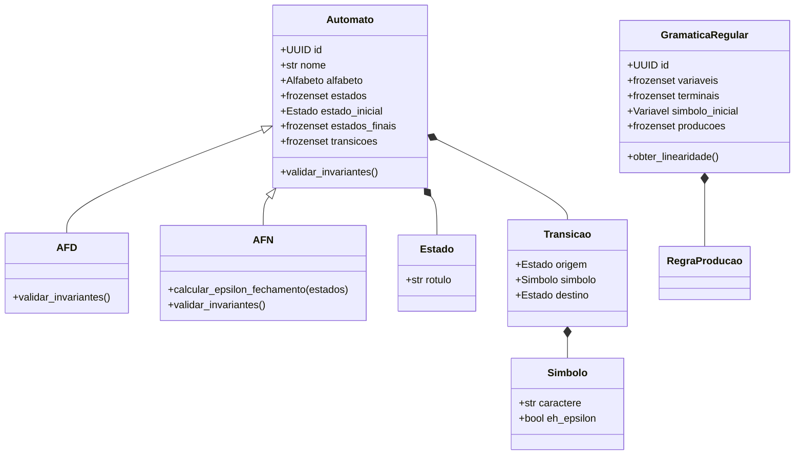

# Manual Técnico: Simulador de Autômatos e Gramáticas

Este manual apresenta a especificação técnica, decisões de design e arquitetura do simulador de autômatos desenvolvido sob a ótica de Clean Architecture e Domain-Driven Design (DDD).

---

## 1. Arquitetura do Sistema

O projeto adota uma arquitetura em camadas concêntricas perfeitamente isoladas. A regra de dependência dita que o fluxo de dependências aponta exclusivamente para dentro (em direção ao domínio/core).

### Estrutura de Camadas:
1. **Core (Domínio)**:
   * **Value Objects (`core/value_objects/`)**: Objetos imutáveis com validação própria (ex: `Simbolo`, `Estado`, `Transicao`, `Alfabeto`, `Palavra`, `RegraProducao`, `PassoDidatico`).
   * **Entidades (`core/entities/`)**: Modelos ricos contendo identificação de ciclo de vida (`Automato`, `AFD`, `AFN`, `GramaticaRegular`) e validação matemática de invariantes em tempo de inicialização.
   * **Domain Services (`core/services/`)**: Implementação pura de algoritmos teóricos complexos (Subset Construction, Moore Partitions, Simulação, etc.).
   * **Ports (`core/ports/`)**: Interfaces de saída de domínio para desacoplar a escrita didática de logs (`DidacticTracePort`).
2. **Application (Orquestração)**:
   * **DTOs (`application/dtos/`)**: Estruturas de dados planas imutáveis para tráfego entre interfaces e a lógica de orquestração.
   * **Use Cases (`application/use_cases/`)**: Orquestram as regras de aplicação e coordenam chamadas ao core e portas externas.
   * **Ports (`application/ports/`)**: Interfaces de infraestrutura (como `AutomatonRepositoryPort` e `GrammarRepositoryPort`).
3. **Infrastructure (Suporte Físico)**:
   * **Repositories (`infrastructure/repositories/`)**: Persistência em memória RAM com suporte a exclusão mútua (`Lock`) para concorrência.
   * **Exporters (`infrastructure/exporters/`)**: Conversores de entidades para representações de string limpas ou estruturadas em JSON.
   * **Logging (`infrastructure/logging/`)**: Emissão de logs operacionais e de falhas do sistema para terminal e `logs/app.log`.
4. **Interface (Apresentação)**:
   * **CLI (`interface/cli/`)**: Interface interativa de console com fluxo guiado e apresentação estruturada de dados.

---

## 2. Invariantes e Validações Matemáticas no Domínio

As entidades validam rigorosamente suas propriedades matemáticas no construtor (`__post_init__`):
* **`Automato`**: Garante que o estado inicial e os estados finais pertencem ao conjunto de estados global do autômato. Garante também que as transições só operam sobre símbolos contidos no alfabeto ou no símbolo vazio.
* **`AFD`**: Garante a propriedade de determinismo:
  * Não permite transições vazias ($\epsilon$).
  * Para cada estado e símbolo do alfabeto, há no máximo uma transição de saída definida.
* **`GramaticaRegular`**:
  * Valida que não há mistura de linearidades (uma gramática regular deve ser linear à direita **ou** linear à esquerda, nunca mista).
  * Valida que o lado esquerdo é composto por apenas uma variável não-terminal, e o lado direito contém no máximo uma variável e um terminal, dispostos conforme o tipo de linearidade.

---

## 3. Diagrama Conceitual de Classes (Mermaid)

---

## 4. Algoritmos Implementados nos Domain Services

1. **`NfaToDfaConverter`**: Executa o algoritmo de determinação via construção de subconjuntos. Utiliza o cálculo do $\varepsilon$-fechamento reflexivo e transitivo de cada novo conjunto descoberto, mapeando os subconjuntos de estados do AFN para rótulos unificados de estados do AFD.
2. **`DfaMinimizer`**:
   * Etapa 1: Remove estados não alcançáveis a partir do estado inicial usando busca em grafo.
   * Etapa 2: Particiona os estados remanescentes em dois grupos iniciais (Finais e Não-Finais). Refina as partições iterativamente agrupando estados que fazem transições sob o mesmo símbolo de entrada para estados pertencentes ao mesmo subconjunto da partição atual.
3. **`WordSimulator`**: Simula a cadeia. No caso do AFN, mantém um conjunto dinâmico de estados ativos e atualiza-o a cada passo aplicando transições normais e recalculando os $\varepsilon$-fechamentos.
4. **`AutomatonToGrammarConverter`**: Traduz transições do tipo $q_i \xrightarrow{a} q_j$ para produções gramaticais $V_{q_i} \to aV_{q_j}$. Se $q_j$ for um estado final, também adiciona $V_{q_i} \to a$.
5. **`GrammarToAutomatonConverter`**: Reconhece a linearidade da gramática e cria transições direcionais correspondentes. Gramáticas lineares à direita geram autômatos avançando do estado inicial; lineares à esquerda são mapeadas revertendo as transições a partir de um estado final.
