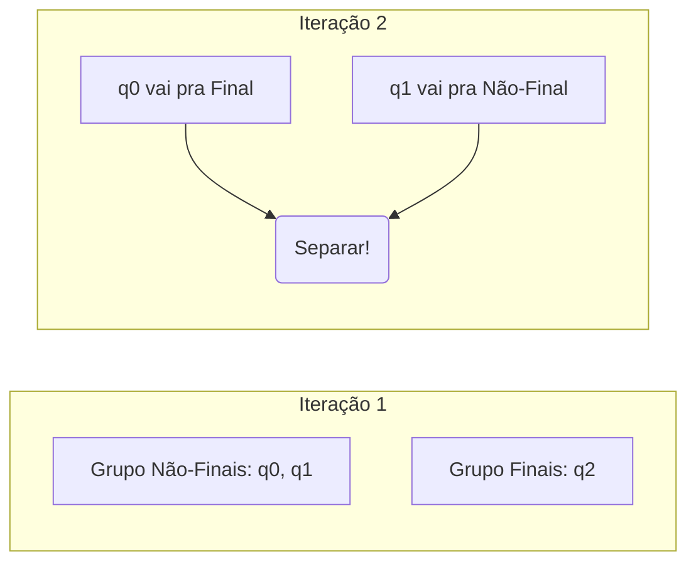

O sistema de simulação de autômatos não é apenas uma calculadora de respostas. Em um ambiente acadêmico, o professor não quer saber apenas se a palavra "010" foi aceita, mas sim *como* ela foi processada, garantindo que o código siga rigorosamente a teoria matemática ensinada em sala de aula. 

Para alcançar essa transparência, as operações principais da teoria foram isoladas no diretório `core/services/`. Em vez de usar atalhos de programação que escondem o processo, cada arquivo espelha um teorema real. A seguir, detalhamos como cada uma dessas operações acontece na prática.

---

### 1. Operação de Reconhecimento: Como a máquina lê uma palavra?

Imagine que um Autômato Finito Não-Determinístico (AFN) receba a palavra "010". A grande questão para o professor é: como o sistema lida com situações em que ele pode ir para dois caminhos diferentes ao ler o primeiro "0"?

**Onde está?**  
A lógica de leitura fica no arquivo `core/services/simulador_palavra.py`.

**Por que foi feito dessa forma?**  
A teoria exige o cálculo da "Função Estendida de Transição" ($\hat{\delta}$), que avalia a palavra símbolo por símbolo. O sistema precisava de uma maneira estruturada para não se perder caso um estado tivesse transições múltiplas ou transições espontâneas ($\epsilon$).

**Divisão do processo em etapas (Como é feito):**

1. **Leitura Passo a Passo:** O simulador pega o estado inicial e verifica a primeira letra ("0").
2. **O Roteamento:** Ele olha na matriz de transições. Quais são os próximos estados possíveis com "0"?
3. **Bifurcação Recursiva (Lidando com a dúvida):** Se houver dois estados destino (ex: $q1$ e $q2$), o código faz uma recursão dupla. Ele chama a si mesmo duas vezes ao mesmo tempo: uma vez assumindo que foi para $q1$ com o restante da palavra "10", e outra assumindo que foi para $q2$ com "10".
4. **Resolução:** Se qualquer uma dessas ramificações chegar ao fim da palavra e bater em um estado de aceitação, a palavra "010" inteira é considerada válida.

```mermaid
graph TD
    A[Estado Atual: q0 | Palavra: 010] -->|Lê '0'| B[Caminho 1: q1 | Resto: 10]
    A -->|Lê '0'| C[Caminho 2: q2 | Resto: 10]
    B --> D[...]
    C --> E[...]
```

---

### 2. Determinização: Removendo o Não-Determinismo

O AFN é flexível, mas o Autômato Finito Determinístico (AFD) é previsível. Um professor vai perguntar: como garantimos que o AFD resultante aceite exatamente a mesma linguagem que o AFN original sem perder informação?

**Onde está?**  
O processo de conversão está em `core/services/determinizador.py`.

**Por que foi feito dessa forma?**  
Optou-se por implementar literalmente o algoritmo formal da "Construção de Subconjuntos". Isso evita aproximações e gera um AFD perfeitamente alinhado com o teorema matemático.

**Divisão do processo em etapas:**

1. **O Fecho-$\epsilon$ (Epsilon Closure):** Antes de ler qualquer símbolo novo, o sistema analisa o estado inicial. Se houver transições vazias (passagens onde nenhuma letra é lida), o sistema agrupa todos os estados alcançáveis por elas. Esse grupão inicial se torna o "Estado 0" do nosso novo AFD.
2. **Avaliação de Alcance:** A partir desse novo superestado, o sistema testa todas as letras do alfabeto (ex: "0" e "1"). Para onde o grupão vai ao ler "0"? 
3. **Fusão de Destinos:** Se a leitura de "0" levar para os antigos estados $q1$ e $q3$, o sistema cria um novo superestado chamado "q1_q3".
4. **Estabilização:** O processo se repete para cada novo superestado gerado até que nenhum grupo novo apareça.

```python
# A ideia por trás do determinizador em código real
def construir_subconjuntos(afn):
    # 1. Pega tudo que é alcançável no início sem ler letras (Fecho Epsilon)
    estado_inicial_afd = calcular_fecho_epsilon(afn.estado_inicial)
    
    # 2. Continua aglomerando os estados destino para cada nova letra
    # até não haverem mais novos agrupamentos
    ...
```

---

### 3. Minimização: Enxugando a Estrutura

Ao converter ou manipular autômatos, frequentemente geramos estados inúteis ou redundantes. A minimização prova que o autômato está em sua forma mais simples e otimizada.

**Onde está?**  
A limpeza funcional fica em `core/services/minimizador.py`.

**Por que foi feito dessa forma?**  
Aplicou-se o "Teorema de Myhill-Nerode" usando uma tabela de refinamento. É necessário primeiro excluir o que não é alcançável para poupar memória e, em seguida, separar rigorosamente o que faz diferença do que é apenas cópia. 

**Divisão do processo em etapas:**

1. **Remoção do Lixo (Inalcançáveis):** O sistema percorre o autômato a partir do estado inicial. Qualquer estado que não tenha sido tocado nessa caminhada é apagado para sempre.
2. **A Primeira Divisão (Classes Base):** Os estados restantes são divididos em dois grandes blocos: os "Finais" (aceitação) e os "Não-Finais" (rejeição).
3. **O Teste de Gêmeos (Classes de Equivalência):** O sistema pega os estados dentro do bloco "Não-Final" e testa o mesmo símbolo de input (ex: "1"). Se o estado $qA$ e o estado $qB$ reagirem ao "1" indo para blocos diferentes (ex: $qA$ vai para um Final, e $qB$ vai para um Não-Final), fica provado que eles não são equivalentes. O sistema os separa.
4. **Repetição:** Esse processo de quebrar grupos continua até que nenhum estado precise ser separado do seu grupo.



---

### Essência

Todo o sistema é focado na estabilidade teórica. Quando um input quebra a linearidade (como transições vazias ou múltiplas), o código não ignora o problema ou cria atalhos. Ele recorre à teoria exata: resolve o não-determinismo com chamadas recursivas bifurcadas, une os fechos vazios em superestados iterativos e divide estados redundantes através do teste de agrupamento iterativo. O código e o papel contam exatamente a mesma história matemática.

### Termos Técnicos para Auditoria

* **Função Estendida ($\hat{\delta}$):** A fórmula matemática que caminha estado por estado lendo a palavra inteira em vez de uma letra só.
* **Construção de Subconjuntos:** O método iterativo que une destinos múltiplos em um superestado único e determinístico.
* **Fecho-$\epsilon$:** A varredura inicial e contínua que coleta todos os estados alcançáveis sem gastar nenhum símbolo de entrada.
* **Classes de Equivalência:** O agrupamento de estados que se comportam de forma idêntica para qualquer possibilidade futura de input.
